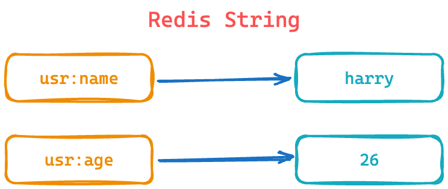
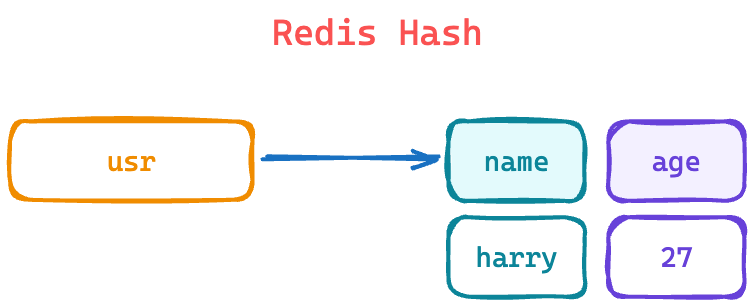
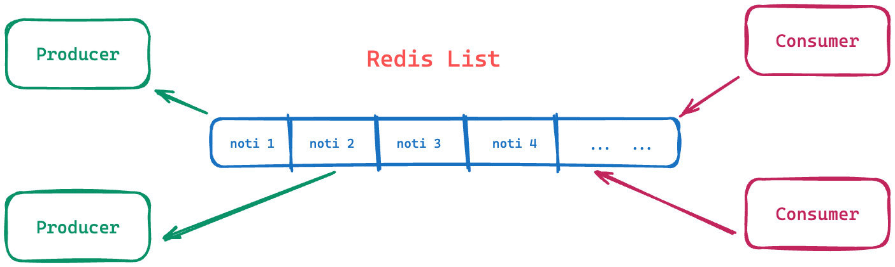
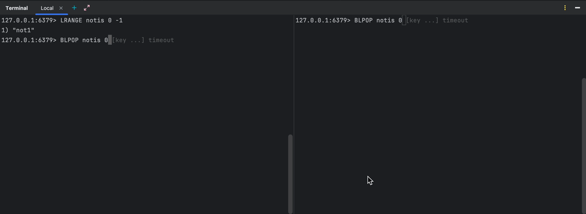

<h3 align="center">
    Redis Guide
</h3>

### Redis Basic

#### I. Summary:

**_Redis strings_** store sequences of bytes, including text, serialized objects, and binary arrays. As such, strings
are the simplest type of value you can associate with a Redis key. They're often used for caching, but they support
additional functionality that lets you implement counters and perform bitwise operations, too.

<div></div><br/>

#### II. Basic Data types:

| String type    | size        |
|----------------|-------------|
| **_embsting_** | <= 44 bytes |
| **_raw_**      | \> 44 bytes |
| _**int**_      | integer     |

#### III. Basic Command:

| Command | Description                  |
|---------|------------------------------|
| SET     | Add key and value            |
| MSET    | Add multiple keys and values |
| GET     | Get value by key             |
| MGET    | Get multi values by keys     |
| STRLEN  | Get value size of key        |
| KEYS    | Get keys by pattern          |
| EXISTS  | Check key exist or not       |
| INCR    | Increase the number by 1     |
| INCRBY  | Increase the number by n     |
| DECR    | Decrease the number by 1     |
| DECRBY  | Decrease the number by n     |

<details>

<summary><strong>Example</strong></summary>

**Set value**

```shell
127.0.0.1:6379> SET name harry
OK
```

**Get type**

```shell
127.0.0.1:6379> OBJECT ENCODING name
"embstr"
```

**Set multiple values**

```shell
127.0.0.1:6379> MSET key1 value1 key2 value2
OK
```

**Get value by key**

```shell
127.0.0.1:6379> GET name
"harry"
```

**Get multiple values**

```shell
127.0.0.1:6379> MGET key1 key2
1) "value1"
2) "value2"
```

**Get all keys**

```shell
127.0.0.1:6379> KEYS *
1) "key1"
2) "key2"
3) "name"
```

**Get value length by key**

```shell
127.0.0.1:6379> STRLEN name
(integer) 5
```

**Check key existed or not**

```shell
127.0.0.1:6379> EXISTS name
(integer) 1
```

**Delete key**

```shell
127.0.0.1:6379> DEL name
(integer) 1
```

**Increase number**

```shell
127.0.0.1:6379> set num 1
OK
127.0.0.1:6379> INCR num
(integer) 2
127.0.0.1:6379> INCR num
(integer) 3
127.0.0.1:6379> INCRBY num 2
(integer) 5
```

**Decrease number**

```shell
127.0.0.1:6379> DECR num
(integer) 4
127.0.0.1:6379> DECRBY num 3
(integer) 1
```

**Set expire time for key and check remaining expire time**

```shell
127.0.0.1:6379> SET lock 1 EX 10
OK
127.0.0.1:6379> TTL lock
(integer) 4
```

| Param key | Unit        |
|-----------|-------------|
| EX        | second      |
| PX        | millisecond |

**Set key if it is not existed**

```shell
127.0.0.1:6379> SET year 2024 NX
OK
127.0.0.1:6379> SET year 2025 NX
(nil)
```

</details>

### Redis Hash

#### I. Summary:

**_Redis hashes_** are record types structured as collections of field-value pairs. You can use hashes to represent
basic objects and to store groupings of counters, among other things.

<div></div>

**List command:**

| Command | Description                            |
|---------|----------------------------------------|
| HSET    | Add a hash                             |
| HGET    | Get value by single field              |
| HMGET   | Get values by multi keys               |
| HDEL    | Delete field in a hash                 |
| HLEN    | Get number of keys in hash             |
| HGETALL | Get all pair key-value in hash         |
| HKEYS   | Get all keys in hash                   |
| HEXISTS | Check key exist or not in hash         |
| HINCRBY | Increase the field number in hash by n |

<details>

<summary><strong>Example</strong></summary>

**HSET**

```shell
127.0.0.1:6379> HSET user:001 name harry age 26
(integer) 1
```

**HGET**

```shell
127.0.0.1:6379> HGET user:001 name
"harry"
```

**HMGET**

```shell
127.0.0.1:6379> HMGET user:001 name age
1) "harry"
2) "26"
```

**HDEL**

```shell
127.0.0.1:6379> HDEL user:001 age
(integer) 1
```

**HGETALL**

```shell
127.0.0.1:6379> HGETALL user:002
1) "name"
2) "hai"
3) "age"
4) "26"
```

**HKEYS**

```shell
127.0.0.1:6379> HKEYS user:002
1) "name"
2) "age"
```

**HEXISTS**

```shell
127.0.0.1:6379> HEXISTS user:002 age
(integer) 1
127.0.0.1:6379> HEXISTS user:002 age1
(integer) 0
```

**HINCRBY**

```shell
127.0.0.1:6379> HINCRBY user:002 age 1
(integer) 27
127.0.0.1:6379> HINCRBY user:002 age -1
(integer) 26
```

</details>

### Redis List

#### I. Summary:

**_Redis lists_** are linked lists of string values. Redis lists are frequently used to:

- Implement stacks and queues.
- Build queue management for background worker systems.

<div></div>

**List command:**

| Command | Description                                           |
|---------|-------------------------------------------------------|
| LPUSH   | Add items to the left side of the list                |
| RPUSH   | Add items to the right side of the list               |
| LRANGE  | Get items in list                                     |
| LPOP    | Get and delete a item from the left side in the list  |
| RPOP    | Get and delete a item from the right side in the list |
| LLEN    | Get size of list                                      |
| LINDEX  | Get item by index                                     |
| LREM    | Get delete item start from position                   |
| LREM    | Get delete item start from position                   |
| LTRIM   | Trim the list                                         |
| LSET    | Update item by index                                  |
| LINSERT | Insert a value before or after a specified value      |

<details>

<summary><strong>Example</strong></summary>

**Push**

```shell
127.0.0.1:6379> LPUSH notis not1 not2
(integer) 2
127.0.0.1:6379> RPUSH notis not3
(integer) 3
```

**Get all items**

```shell
127.0.0.1:6379> LRANGE notis 0 -1
1) "not2"
2) "not1"
3) "not3"
```

**Pop from the left side**

```shell
127.0.0.1:6379> LPOP notis
"not2"
127.0.0.1:6379> LRANGE notis 0 -1
1) "not1"
2) "not3"
```

_Note_: Also, we can get and delete n items from the left side by doing the following:

```shell
127.0.0.1:6379> LPOP notis 2
1) "not2"
2) "not1"
127.0.0.1:6379> LRANGE notis 0 -1
1) "not3"
```

**Get size of list**

```shell
127.0.0.1:6379> LLEN notis
(integer) 3
```

**Delete the item with a value of 4, starting from index 1.**

```shell
127.0.0.1:6379> LPush points 1 2 3 4 5 6 7 8
(integer) 8
127.0.0.1:6379> LRANGE points 0 -1
1) "8"
2) "7"
3) "6"
4) "5"
5) "4"
6) "3"
7) "2"
8) "1"
127.0.0.1:6379> LREM points 1 4
(integer) 1
127.0.0.1:6379> LRANGE points 0 -1
1) "8"
2) "7"
3) "6"
4) "5"
5) "3"
6) "2"
7) "1"
```

**Retrieve the item at index 4**

```shell
127.0.0.1:6379> LINDEX points 2
"6"
```

**Trim the list to keep only the items from index 1 to index 4**

```shell
127.0.0.1:6379> LTRIM points 1 4
OK
127.0.0.1:6379> LRANGE points 0 -1
1) "7"
2) "6"
3) "5"
4) "3"
```

**Update item at index 1**

```shell
127.0.0.1:6379> LSET points 1 16
OK
127.0.0.1:6379> LRANGE points 0 -1
1) "7"
2) "16"
3) "5"
4) "3"
```

**Insert 10 before the item with a value of 16**

```shell
127.0.0.1:6379> LINSERT points BEFORE 16 10
(integer) 5
127.0.0.1:6379> LRANGE points 0 -1
1) "7"
2) "10"
3) "16"
4) "5"
5) "3"
```

**Insert 20 after the item with a value of 16**

```shell
127.0.0.1:6379> LINSERT points AFTER 16 20
(integer) 6
127.0.0.1:6379> LRANGE points 0 -1
1) "7"
2) "10"
3) "16"
4) "20"
5) "5"
6) "3"
127.0.0.1:6379> 
```

</details>

#### II. Scenario Used:

**Scenario 1:** We have two consumer read notifications from the queue (Redis List). We can use LPOP with blocking (*
*_BLPOP_**) to wait for new notifications.

<div></div>
