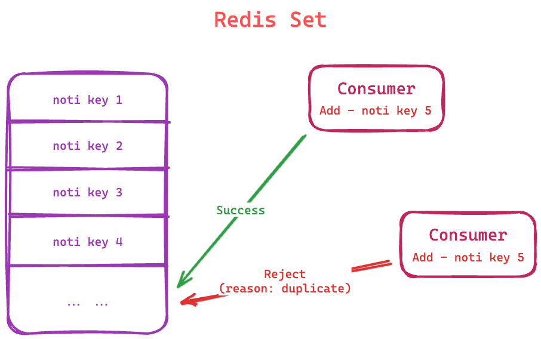
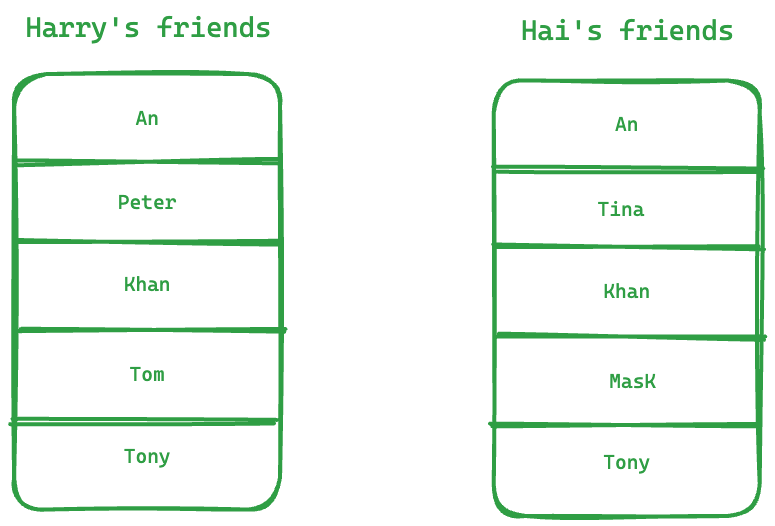
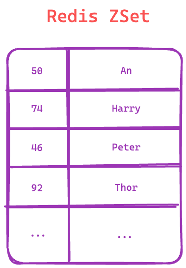

<h3 align="center">
    Redis Guide
</h3>

### Redis Overview

<br/><div></div><br/>

Read more about redis. Please check [link](https://architecturenotes.co/p/redis)

### Redis Basic

#### I. Summary:

**_Redis strings_** store sequences of bytes, including text, serialized objects, and binary arrays. As such, strings
are the simplest type of value you can associate with a Redis key. They're often used for caching, but they support
additional functionality that lets you implement counters and perform bitwise operations, too.

<div></div><br/>

#### II. Basic Data types:

| String type    | size        |
|----------------|-------------|
| **_embsting_** | <= 44 bytes |
| **_raw_**      | \> 44 bytes |
| _**int**_      | integer     |

#### III. Basic Command:

| Command  | Description                  |
|----------|------------------------------|
| SET      | Add key and value            |
| MSET     | Add multiple keys and values |
| GET      | Get value by key             |
| MGET     | Get multi values by keys     |
| STRLEN   | Get value size of key        |
| KEYS     | Get keys by pattern          |
| EXISTS   | Check key exist or not       |
| INCR     | Increase the number by 1     |
| INCRBY   | Increase the number by n     |
| DECR     | Decrease the number by 1     |
| DECRBY   | Decrease the number by n     |
| FLUSHALL | Delete everything            |

<details>

<summary><strong>Example</strong></summary>

**Set value**

```shell
127.0.0.1:6379> SET name harry
OK
```

**Get type**

```shell
127.0.0.1:6379> OBJECT ENCODING name
"embstr"
```

**Set multiple values**

```shell
127.0.0.1:6379> MSET key1 value1 key2 value2
OK
```

**Get value by key**

```shell
127.0.0.1:6379> GET name
"harry"
```

**Get multiple values**

```shell
127.0.0.1:6379> MGET key1 key2
1) "value1"
2) "value2"
```

**Get all keys**

```shell
127.0.0.1:6379> KEYS *
1) "key1"
2) "key2"
3) "name"
```

**Get value length by key**

```shell
127.0.0.1:6379> STRLEN name
(integer) 5
```

**Check key existed or not**

```shell
127.0.0.1:6379> EXISTS name
(integer) 1
```

**Delete key**

```shell
127.0.0.1:6379> DEL name
(integer) 1
```

**Increase number**

```shell
127.0.0.1:6379> set num 1
OK
127.0.0.1:6379> INCR num
(integer) 2
127.0.0.1:6379> INCR num
(integer) 3
127.0.0.1:6379> INCRBY num 2
(integer) 5
```

**Decrease number**

```shell
127.0.0.1:6379> DECR num
(integer) 4
127.0.0.1:6379> DECRBY num 3
(integer) 1
```

**Set expire time for key and check remaining expire time**

```shell
127.0.0.1:6379> SET lock 1 EX 10
OK
127.0.0.1:6379> TTL lock
(integer) 4
```

| Param key | Unit        |
|-----------|-------------|
| EX        | second      |
| PX        | millisecond |

**Set key if it is not existed**

```shell
127.0.0.1:6379> SET year 2024 NX
OK
127.0.0.1:6379> SET year 2025 NX
(nil)
```

</details>

### Redis Hash

#### I. Summary:

**_Redis hashes_** are record types structured as collections of field-value pairs. You can use hashes to represent
basic objects and to store groupings of counters, among other things.

<div></div>

**List command:**

| Command | Description                            |
|---------|----------------------------------------|
| HSET    | Add a hash                             |
| HGET    | Get value by single field              |
| HMGET   | Get values by multi keys               |
| HDEL    | Delete field in a hash                 |
| HLEN    | Get number of keys in hash             |
| HGETALL | Get all pair key-value in hash         |
| HKEYS   | Get all keys in hash                   |
| HEXISTS | Check key exist or not in hash         |
| HINCRBY | Increase the field number in hash by n |

<details>

<summary><strong>Example</strong></summary>

**HSET**

```shell
127.0.0.1:6379> HSET user:001 name harry age 26
(integer) 1
```

**HGET**

```shell
127.0.0.1:6379> HGET user:001 name
"harry"
```

**HMGET**

```shell
127.0.0.1:6379> HMGET user:001 name age
1) "harry"
2) "26"
```

**HDEL**

```shell
127.0.0.1:6379> HDEL user:001 age
(integer) 1
```

**HGETALL**

```shell
127.0.0.1:6379> HGETALL user:002
1) "name"
2) "hai"
3) "age"
4) "26"
```

**HKEYS**

```shell
127.0.0.1:6379> HKEYS user:002
1) "name"
2) "age"
```

**HEXISTS**

```shell
127.0.0.1:6379> HEXISTS user:002 age
(integer) 1
127.0.0.1:6379> HEXISTS user:002 age1
(integer) 0
```

**HINCRBY**

```shell
127.0.0.1:6379> HINCRBY user:002 age 1
(integer) 27
127.0.0.1:6379> HINCRBY user:002 age -1
(integer) 26
```

</details>

### Redis List

#### I. Summary:

**_Redis lists_** are linked lists of string values. Redis lists are frequently used to:

- Implement stacks and queues.
- Build queue management for background worker systems.

<div></div>

**List command:**

| Command | Description                                           |
|---------|-------------------------------------------------------|
| LPUSH   | Add items to the left side of the list                |
| RPUSH   | Add items to the right side of the list               |
| LRANGE  | Get items in list                                     |
| LPOP    | Get and delete a item from the left side in the list  |
| RPOP    | Get and delete a item from the right side in the list |
| LLEN    | Get size of list                                      |
| LINDEX  | Get item by index                                     |
| LREM    | Get delete item start from position                   |
| LREM    | Get delete item start from position                   |
| LTRIM   | Trim the list                                         |
| LSET    | Update item by index                                  |
| LINSERT | Insert a value before or after a specified value      |

<details>

<summary><strong>Example</strong></summary>

**Push**

```shell
127.0.0.1:6379> LPUSH notis not1 not2
(integer) 2
127.0.0.1:6379> RPUSH notis not3
(integer) 3
```

**Get all items**

```shell
127.0.0.1:6379> LRANGE notis 0 -1
1) "not2"
2) "not1"
3) "not3"
```

**Pop from the left side**

```shell
127.0.0.1:6379> LPOP notis
"not2"
127.0.0.1:6379> LRANGE notis 0 -1
1) "not1"
2) "not3"
```

_Note_: Also, we can get and delete n items from the left side by doing the following:

```shell
127.0.0.1:6379> LPOP notis 2
1) "not2"
2) "not1"
127.0.0.1:6379> LRANGE notis 0 -1
1) "not3"
```

**Get size of list**

```shell
127.0.0.1:6379> LLEN notis
(integer) 3
```

**Delete the item with a value of 4, starting from index 1.**

```shell
127.0.0.1:6379> LPush points 1 2 3 4 5 6 7 8
(integer) 8
127.0.0.1:6379> LRANGE points 0 -1
1) "8"
2) "7"
3) "6"
4) "5"
5) "4"
6) "3"
7) "2"
8) "1"
127.0.0.1:6379> LREM points 1 4
(integer) 1
127.0.0.1:6379> LRANGE points 0 -1
1) "8"
2) "7"
3) "6"
4) "5"
5) "3"
6) "2"
7) "1"
```

**Retrieve the item at index 4**

```shell
127.0.0.1:6379> LINDEX points 2
"6"
```

**Trim the list to keep only the items from index 1 to index 4**

```shell
127.0.0.1:6379> LTRIM points 1 4
OK
127.0.0.1:6379> LRANGE points 0 -1
1) "7"
2) "6"
3) "5"
4) "3"
```

**Update item at index 1**

```shell
127.0.0.1:6379> LSET points 1 16
OK
127.0.0.1:6379> LRANGE points 0 -1
1) "7"
2) "16"
3) "5"
4) "3"
```

**Insert 10 before the item with a value of 16**

```shell
127.0.0.1:6379> LINSERT points BEFORE 16 10
(integer) 5
127.0.0.1:6379> LRANGE points 0 -1
1) "7"
2) "10"
3) "16"
4) "5"
5) "3"
```

**Insert 20 after the item with a value of 16**

```shell
127.0.0.1:6379> LINSERT points AFTER 16 20
(integer) 6
127.0.0.1:6379> LRANGE points 0 -1
1) "7"
2) "10"
3) "16"
4) "20"
5) "5"
6) "3"
```

</details>

#### II. Scenario Used:

**Scenario 1:** We have two consumer read notifications from the queue (Redis List). We can use LPOP with blocking (*
*_BLPOP_**) to wait for new notifications.

<div></div>

### Redis Set

#### I. Summary:

**_A Redis set_** is an unordered collection of unique strings (members). You can use Redis sets to efficiently:

- Track unique items (e.g., track all unique IP addresses accessing a given blog post).
- Represent relations (e.g., the set of all users with a given role).
- Perform common set operations such as intersection, unions, and differences.

<div></div>

**List command:**

| Command     | Description                              |
|-------------|------------------------------------------|
| SADD        | Add a items to set                       |
| SMEMBERS    | Get all item in the set                  |
| SISMEMBER   | Check if the item already exists or not  |
| SCARD       | Get number of items of the set           |
| SREM        | Delete by item                           |
| SPOP        | Delete the random items                  |
| SRANDMEMBER | Get the random items                     |
| SMOVE       | Move a items from the set to another set |

<details>

<summary><strong>Example</strong></summary>

**Add items**

```shell
127.0.0.1:6379> SADD notis noti1 noti2
(integer) 2
127.0.0.1:6379> SADD notis noti3
(integer) 1
```

```shell
127.0.0.1:6379> SADD notis noti3
(integer) 0
```

Adding `noti3` to `notis` failed because `noti3` already exists

**Get all items**

```shell
127.0.0.1:6379> SMEMBERS notis
1) "noti1"
2) "noti2"
3) "noti3"
```

**Check if the item already exists or not**

```shell
127.0.0.1:6379> SISMEMBER notis noti3
(integer) 1
127.0.0.1:6379> SISMEMBER notis noti4
(integer) 0
```

**Check if the item already exists or not**

```shell
127.0.0.1:6379> SCARD notis
(integer) 3
```

**Get random items**

```shell
127.0.0.1:6379> SRANDMEMBER notis
"noti3"
127.0.0.1:6379> SRANDMEMBER notis 2
1) "noti2"
2) "noti3"
```

**Move `noti1` from `notis` to `notis:1`**

```shell
127.0.0.1:6379> SMOVE notis notis:1 noti1
(integer) 1
127.0.0.1:6379> SMEMBERS notis:1
1) "noti1"
127.0.0.1:6379> SMEMBERS notis
1) "noti2"
2) "noti3" 
```

</details>

#### II. Scenario Used:

**Scenario 1:** friends.

<div></div>

Get mutual friends:

```shell
127.0.0.1:6379> SINTER hai:fr harry:fr
1) "an"
2) "khan"
3) "tony"
```

Get hai's other friends:

```shell
127.0.0.1:6379> SDIFF hai:fr harry:fr
1) "tina"
2) "mask"
```

**Scenario 2:** Spin the wheel of fortune.

```shell
127.0.0.1:6379> SADD wheel m10 cr7 mbappe kaka bale zidane benzema
(integer) 7
127.0.0.1:6379> SMEMBERS wheel
1) "m10"
2) "cr7"
3) "mbappe"
4) "kaka"
5) "bale"
6) "zidane"
7) "benzema"
```

Person who wins the special prize

```shell
127.0.0.1:6379> SPOP wheel
"cr7"
```

Remaining members

```shell
127.0.0.1:6379> SMEMBERS wheel
1) "m10"
2) "mbappe"
3) "kaka"
4) "bale"
5) "zidane"
6) "benzema"
```

3 consolation prizes

```shell
127.0.0.1:6379> SRANDMEMBER wheel 3
1) "mbappe"
2) "zidane"
3) "benzema"
```

_or_

```shell
127.0.0.1:6379> SPOP wheel 3
1) "m10"
2) "kaka"
3) "bale"
```

### Redis ZSet

#### I. Summary:

A Redis sorted set is a collection of unique strings (members) ordered by an associated score. When more than one string
has the same score, the strings are ordered lexicographically. Some use cases for sorted sets include:

- Leaderboards. For example, you can use sorted sets to easily maintain ordered lists of the highest scores in a massive
  online game.
- Rate limiters. In particular, you can use a sorted set to build a sliding-window rate limiter to prevent excessive API
  requests.

You can think of sorted sets as a mix between a Set and a Hash. Like sets, sorted sets are composed of unique,
non-repeating string elements, so in some sense a sorted set is a set as well.

<div></div>

**List command:**

| Command       | Description                                  |
|---------------|----------------------------------------------|
| ZADD          | Add a items to zset                          |
| ZSCORE        | Get item's score                             |
| ZRANGE        | Get items and sort by asc                    |
| ZREVRANGE     | Get items and sort by desc                   |
| ZREM          | Delete by item                               |
| ZCARD         | Get number of items of the zset              |
| ZINCRBY       | Increase score                               |
| ZRANGEBYSCORE | List item with scores within a special range |

<details>

<summary><strong>Example</strong></summary>

**Add items**

```shell
127.0.0.1:6379> ZADD score:2024 50 an 74 harry 46 peter 92 thor
(integer) 4
127.0.0.1:6379> ZADD score:2024 60 tom
(integer) 1
```

**Show items and sort by asc**

```shell
127.0.0.1:6379> ZRANGE score:2024 0 -1
1) "peter"
2) "an"
3) "tom"
4) "harry"
5) "thor"
```

**Show items and sort by desc**

```shell
127.0.0.1:6379> ZREVRANGE score:2024 0 -1
1) "thor"
2) "harry"
3) "tom"
3) "peter"
4) "an"
```

**Get Harry's score**

```shell
127.0.0.1:6379> ZSCORE score:2024 harry
"74"
```

**Delete item**

```shell
127.0.0.1:6379> ZREM score:2024 peter
(integer) 1
```

**Count number of items**

```shell
127.0.0.1:6379> ZCARD score:2024
(integer) 4
```

**Increase Tom's score by 4**

```shell
127.0.0.1:6379> ZINCRBY score:2024 4 tom
"64"
```

**List items with scores from 75 to 90**

```shell
127.0.0.1:6379> ZRANGEBYSCORE score:2024 50 90
1) "an"
2) "tom"
3) "harry"
```

**List top 3 items with scores**

```shell
127.0.0.1:6379> ZREVRANGE score:2024 0 2 WITHSCORES
1) "thor"
2) "92"
3) "harry"
4) "74"
5) "tom"
6) "64"
```

</details>

### Redis Transaction

[_Coming soon..._]

### Redis Pub/Sub

<div></div>
